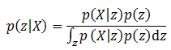
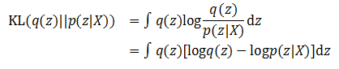
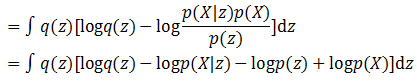
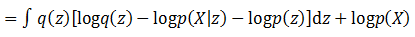
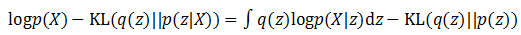
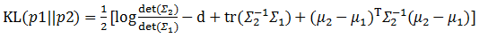
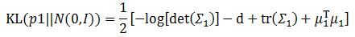
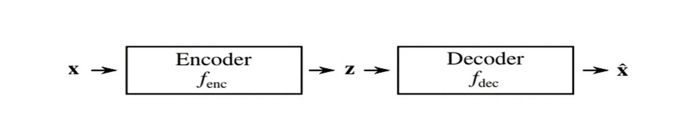

# 变分自编码器

###### 变分自编码器，简而言之，就是将数据经过提取特征得到低维隐表示，然后加入噪声后重建得到新数据的过程。生成模型，众所周知，是用来生成和原始数据相似，而不同于原始数据的具备多样性的数据的神经网络。其中，变分自编码器作为经典的生成模型，有着和最近大火的GAN(对抗生成网络)有着不同的生成数据的方法。

###### 变分自编码器实际上由两个部分构成，一个编码器(Encoder),一个解码器(Decoder)。

###### 其中编码器为从数据分布中采样隐变量或者潜变量z，即通过最大化概率$p(z|x$)采样z,也就是利用贝叶斯公式：

###### 而解码器为$p(x|z)$,通过隐变量重构恢复数据。然而由于编码器采样z的公式在复杂的模型和大规模数据面前极难求解。为了解决这个问题，实际训练中用一个变分函数$q(z|x)$代替$p(z|X)$,从而将最大化$p(z|x)$转化为$q(z|x)$。

###### 引用自花书即深度学习一书中的一句话：变分自编码器背后的关键思想是，它们可以通过最大化数据点x相关联的变分下界L(q)来训练:公式一

$L(q)=E_{q(z|x)}\log p(z,x)+H(q(z|x))$

$=E_{q(z|x)}log(p(x|z)-D_{kl}((q(z|x))||p(z))$

$\leq logp(x)$

###### $logp(x)$就是变分自编码器中的变分下界。关于这个公式的推导：前面说了p(z|x)极其难计算，要通过一个$q(z|x)$来近似它，衡量两个后验概率之间的熵可以用KL散度，所以目的就是最小化$KL(q(z|x)||p(z|x))$:

###### 代入贝叶斯公式可得：

###### 由于积分的目标是z，这里再将和z无关的项目从积分符号中拿出来，就得到了：

###### 交换左右项：)

###### 训练的目标是希望KL(q(z)||p(z|X))尽可能小，就相当于让等号右边的那部分尽可能变大。优化目标这里就转化为公式一中的两部分：

                            $E_{q(z|x)}log(p(x|z)-D_{kl}((q(z|x))||p(z))$

###### 第一部分是最大化对数似然的期望，第二部分是最小化KL散度。

###### 第二部分中z的先验被假设成一个多维且各维度独立的高斯分布，这里可以给出一个更强的假设，那就是这个高斯分布各维度的均值为0，协方差为单位矩阵。那么前面提到的KL散度公式就从：)

###### 瞬间简化为：)

###### 假设输入数据是一批图像，输出是z，因此这里需要它通过X生成z，并将这一个批次的数据汇总计算得到它们的均值和方差。这样利用上面的公式，KL散度最小化的模型就建立好了。而这第二部分就是编码器的编码器部分。

###### 接下来是第一个优化目标，也就是让公式左边第一项的似然期望最大化。由于前面Encoder模型已经计算出了一批观察变量X对应的隐含变量z，那么这里就可以再建立一个深层模型，根据似然进行建模，输入为隐含变量z，输出为观察变量X。如果输出的图像和前面生成的图像相近，那么就可以认为似然得到了最大化。这个模型被称为Decoder。)

###### 这就是变分自编码器背后的数学思想，和生成对抗网络不同，花书中说变分自编码器的方法是优雅的，理论上令人愉快的，并且易于实现，是生成模型中最先进的方法之一。

###### 在实验中，变分自编码器的生成图片往往会有些模糊，这是它的缺点。然而变分自编码器作为一个优秀的可以捕获数据分布的流行学习算法，在此基础上的Draw，CVAE,与GAN结合的VAE—GAN等都有不错的表现。
